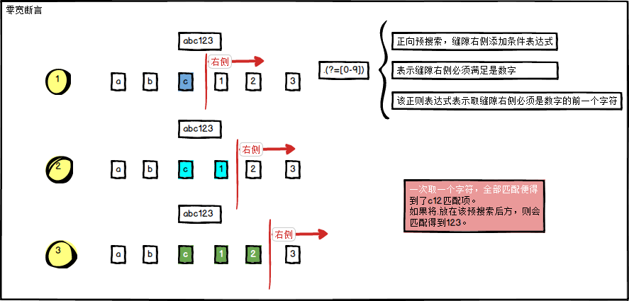
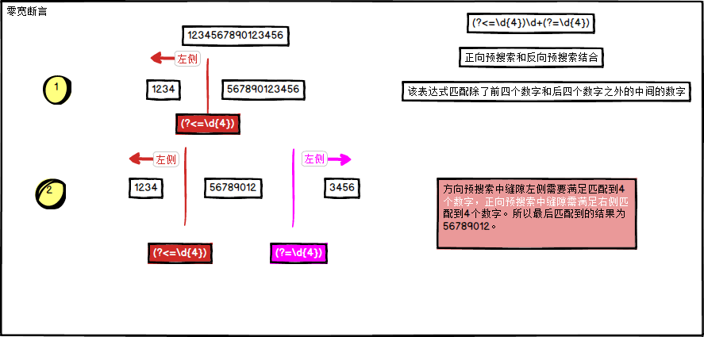

# -
正则表达式
## 一、正则表达式元字符

 **"^"** ：^会匹配行或者字符串的起始位置，有时还会匹配整个文档的起始位置。 

 **"$"**  ：$会匹配行或字符串的结尾

**"\b"** :不会消耗任何字符只匹配一个位置，常用于匹配单词边界 如 我想从字符串中"This is Regex"匹配单独的单词 "is" 正则就要写成 "\bis\b"  

　　  \b 不会匹配is 两边的字符，但它会识别is 两边是否为单词的边界 

| 表达式 | 作用                                                         |
| ------ | ------------------------------------------------------------ |
| ^      | 与字符串开始的地方匹配，不匹配任何字符                       |
| $      | 与字符串结束的地方匹配，不匹配任何字符                       |
| \b     | 匹配一个单词边界，也就是单词和空格之间的位置，不匹配任何字符 |

 **"\d"**: 匹配数字，

　　  例如要匹配一个固定格式的电话号码以0开头前4位后7位，如0737-5686123  正则:^0\d\d\d-\d\d\d\d\d\d\d$ 这里只是为了介绍"\d"字符。

**"\w"**：匹配字母，数字，下划线。

​		例如要匹配字符串"a1234_hhT", `\w+`便可以匹配得到。

**"\s"**：匹配空格

​		\s值匹配单个空格字符，如果需要匹配多个空格，可以使用\s+

**"."**：匹配除了换行符以外的任意字符。

正则表达式中的一些表示方法，可以匹配 '多种字符' 其中的任意一个字符。比如，表达式 "\d" 可以匹配任意一个数字。虽然可以匹配其中任意字符，但是只能是一个，不是多个。这就好比玩扑克牌时候，大小王可以代替任意一张牌，但是只能代替一张牌。

| 表达式 | 可匹配                                                      |
| ------ | ----------------------------------------------------------- |
| \d     | 任意一个数字，0~9 中的任意一个                              |
| \w     | 任意一个字母或数字或下划线，也就是 A~Z,a~z,0~9,_ 中任意一个 |
| \s     | 包括空格、制表符、换页符等空白字符的其中任意一个            |
| .      | 小数点可以匹配除了换行符（\n）以外的任意一个字符            |

**"[abc]"**：字符组，匹配包含括号内元素的字符

使用方括号 [ ] 包含一系列字符，能够匹配其中任意一个字符。用 [^] 包含一系列字符，则能够匹配其中字符之外的任意一个字符。同样的道理，虽然可以匹配其中任意一个，但是只能是一个，不是多个。

| 表达式    | 可匹配                                  |
| --------- | --------------------------------------- |
| [ab5@]    | 匹配 "a" 或 "b" 或 "5" 或 "@"           |
| [^abc]    | 匹配 "a","b","c" 之外的任意一个字符     |
| [f-k]     | 匹配 "f"~"k" 之间的任意一个字母         |
| [^A-F0-3] | 匹配 "A"~"F","0"~"3" 之外的任意一个字符 |

## 二、反义

**"\W"**   匹配任意不是字母，数字，下划线 的字符

   **"\S"**   匹配任意不是空白符的字符

　**"\D"**  匹配任意非数字的字符

   **"\B"**  匹配不是单词开头或结束的位置

`[^abc]` 匹配除了abc以外的任意字符	

## 三、量词

先解释关于量词所涉及到的重要的三个概念

​    贪婪(贪心) 如"*"字符 贪婪量词会首先匹配整个字符串，尝试匹配时，它会选定尽可能多的内容，如果 失败则回退一个字符，然后再次尝试回退的过程就叫做回溯，它会每次回退一个字符，直到找到匹配的内容或者没有字符可以回退。相比下面两种贪婪量词对资源的消耗是最大的，

   懒惰(勉强) 如 "?"  懒惰量词使用另一种方式匹配，它从目标的起始位置开始尝试匹配，每次检查一个字符，并寻找它要匹配的内容，如此循环直到字符结尾处。

   占有  如"+" 占有量词会覆盖整个目标字符串，然后尝试寻找匹配内容 ，但它只尝试一次，不会回溯，就好比先抓一把石头，然后从石头中挑出黄金

​     **"\*"(贪婪)**   重复零次或更多

　　　  例如"aaaaaaaa" 匹配字符串中所有的a  正则： "a*"   会出到所有的字符"a"

​     **"+"(懒惰)**   重复一次或更多次

　　     例如"aaaaaaaa" 匹配字符串中所有的a  正则： "a+"  会取到字符中所有的a字符，  "a+"与"a*"不同在于"+"至少是一次而"*" 可以是0次，

　　     稍后会与"?"字符结合来体现这种区别

​     **"?"(占有)**   重复零次或一次

　　     例如"aaaaaaaa" 匹配字符串中的a 正则 ： "a?" 只会匹配一次，也就是结果只是单个字符a

　  **"{n}"**  重复n次

　　     例如从"aaaaaaaa" 匹配字符串的a 并重复3次 正则：  "a{3}"  结果就是取到3个a字符  "aaa";

　  **"{n,m}"**  重复n到m次

　　     例如正则 "a{3,4}" 将a重复匹配3次或者4次 所以供匹配的字符可以是三个"aaa"也可以是四个"aaaa" 正则都可以匹配到

​     **"{n,}"**  重复n次或更多次

 　　    与{n,m}不同之处就在于匹配的次数将没有上限，但至少要重复n次 如 正则"a{3,}" a至少要重复3次

 把量词了解了之后之前匹配电话号码的正则现在就可以改得简单点了^0\d\d\d-\d\d\d\d\d\d\d$ 可以改为"^0\d+-\d{7}$"。

这样写还不够完美如果因为前面的区号没有做限定，以至于可以输入很多们，而通常只能是3位或者4位，

现在再改一下 "^0\d{2,3}-\d{7}"如此一来区号部分就可以匹配3位或者4位的了

| 表达式 | 作用                                                         |
| ------ | ------------------------------------------------------------ |
| {n}    | 表达式重复n次，比如： "\w{2}" 相当于 "\w\w"； "a{5}" 相当于 "aaaaa" |
| {m,n}  | 表达式至少重复m次，最多重复n次，比如： "ba{1,3}"可以匹配 "ba"或"baa"或"baaa" |
| {m,}   | 表达式至少重复m次，比如：点击测试 "\w\d{2,}"可以匹配 "a12","_456","M12344"... |
| ?      | 匹配表达式0次或者1次，相当于 {0,1}，比如："a[cd]?"可以匹配 "a","ac","ad" |
| +      | 表达式至少出现1次，相当于 {1,}，比如： "a+b"可以匹配 "ab","aab","aaab"... |
| *      | 表达式不出现或出现任意次，相当于 {0,}，比如： "\^*b"可以匹配 "b","^^^b"... |

## 四、捕获分组

先了解在正则中捕获分组的概念，其实就是一个括号内的内容 如 "(\d)\d" 而"(\d)" 这就是一个捕获分组，可以对捕获分组进行 后向引用 (如果后而有相同的内容则可以直接引用前面定义的捕获组，以简化表达式) 如(\d)\d\1 这里的"\1"就是对"(\d)"的后向引用

那捕获分组有什么用呢看个例子就知道了

如  "zery zery" 正则 \b(\w+)\b\s\1\b 所以这里的"\1"所捕获到的字符也是 与(\w+)一样的"zery"，为了让组名更有意义，组名是可以自定义名字的

"\b(?<name>\w+)\b\s\k<name>\b" 用"?<name>"就可以自定义组名了而要后向引用组时要记得写成 "\k<name>";自定义组名后,捕获组中匹配到的值就会保存在定义的组名里

下面列出捕获分组常有的用法

**"(exp)"**    匹配exp,并捕获文本到自动命名的组里

**"(?<name>exp)"**   匹配exp,并捕获文本到名称为name的组里

**"(?:exp)"**  匹配exp,不捕获匹配的文本，也不给此分组分配组号

## 五、零宽断言

以下为零宽断言

- 正向预搜索

**"(?=exp)"**  在被匹配的字符串中，它对所处的 "缝隙" 或者 "两头" 附加的条件是：所在缝隙的右侧，必须能够匹配上 xxxxx 这部分的表达式。因为它只是在此作为这个缝隙上附加的条件，所以它并不影响后边的表达式去真正匹配这个缝隙之后的字符。这就类似 "\b"，本身不匹配任何字符。"\b" 只是将所在缝隙之前、之后的字符取来进行了一下判断，不会影响后边的表达式来真正的匹配。

**"(?!exp)"**  所在缝隙的右侧，必须不能匹配 xxxxx 这部分表达式。

- 反向预搜索

**"(?<=exp)"**  缝隙的左侧，必须满足exp表达式。

**"(?<!exp)"** 缝隙的左侧必须不满足exp表达式。

| 表达式 | 作用                                                         |
| ------ | ------------------------------------------------------------ |
| \|     | 左右两边表达式之间 "或" 关系，匹配左边或者右边               |
| ( )    | (1). 在被修饰匹配次数的时候，括号中的表达式可以作为整体被修饰 (2). 取匹配结果的时候，括号中的表达式匹配到的内容可以被单独得到 |

 举例：表达式 "Tom|Jack" 在匹配字符串 "I'm Tom, he is Jack" 时，匹配结果是：成功；匹配到的内容是："Tom"；匹配到的位置是：开始于4，结束于7。匹配下一个时，匹配结果是：成功；匹配到的内容是："Jack"；匹配到的位置时：开始于15，结束于19。

   举例：表达式 "(go\s*)+" 在匹配 "Let's go go go!" 时]，匹配结果是：成功；匹配到内容是："go go go"；匹配到的位置是：开始于6，结束于14。

   举例：表达式 "￥(\d+\.?\d*)" 在匹配 "＄10.9,￥20.5" 时]，匹配的结果是：成功；匹配到的内容是："￥20.5"；匹配到的位置是：开始于6，结束于10。单独获取括号范围匹配到的内容是："20.5"。
